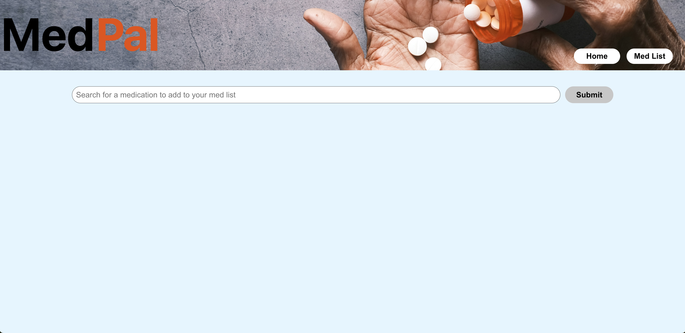
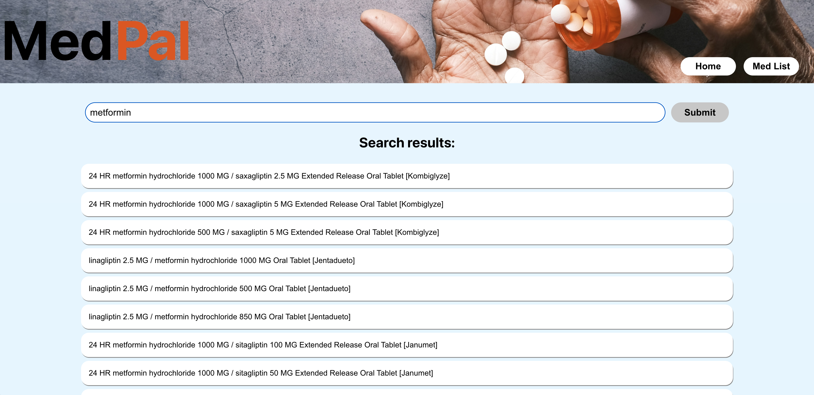
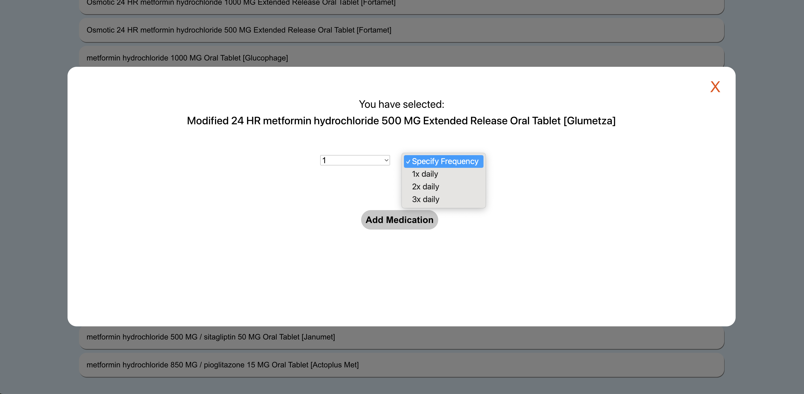
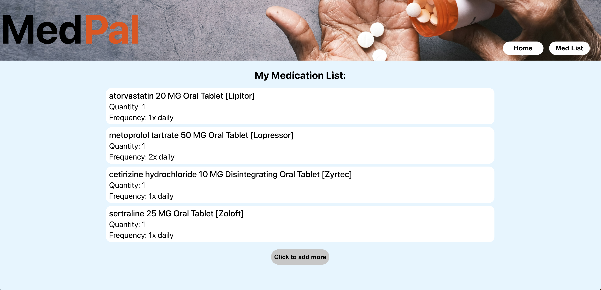

# MedPal

### Abstract:
[//]: <> (Briefly describe what you built and its features. What problem is the app solving? How does this application solve that problem?)
This React application allows a user to track their medications by curating a custom medication list. A user can search for a medication by brand name or generic name and a list of matching options will populate. Once they find their matching medication, they can specify further medication details ("quantity" and "frequency") and then add it to their medication list. When they view their medication list, they can see all of their medications and medication details in one place.

### Installation Instructions:
[//]: <> (What steps does a person have to take to get your app cloned down and running?)
Click here to view the deployed application:  https://medpal-ot7eb0f6j-dana-zacks-projects.vercel.app

### App Preview:
[//]: <> (Provide ONE gif or screenshot of your application - choose the "coolest" piece of functionality to show off.)
https://www.loom.com/share/a68b4070c94c4fdfadc47d93e47743e5

### Context:
[//]: <> (Give some context for the project here. How long did you have to work on it? How far into the Turing program are you?)
This was a solo project completed over the course of 5 days and approximately 35 hours.

### Wins + Challenges:
[//]: <> (What are 2-3 wins you have from this project? What were some challenges you faced - and how did you get over them?)
Wins:
- Creating a responsive UI
- Writing thorough Cypress tests

Challenges:
- Deploying for the first time

### Future Features:
- Build Node backend so that medication list can persist on page load
- Create ability to delete medications from medication list
- Add Jest unit testing

